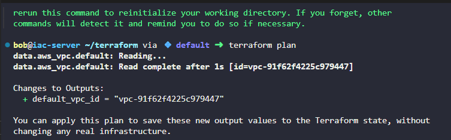
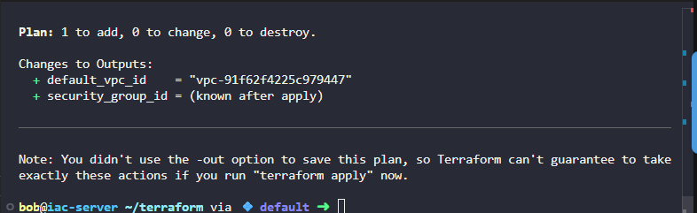
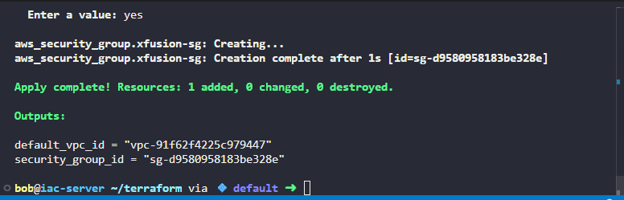

The Nautilus DevOps team is strategizing the migration of a portion of their infrastructure to the AWS cloud. Recognizing the scale of this undertaking, they have opted to approach the migration in incremental steps rather than as a single massive transition. To achieve this, they have segmented large tasks into smaller, more manageable units. This granular approach enables the team to execute the migration in gradual phases, ensuring smoother implementation and minimizing disruption to ongoing operations. By breaking down the migration into smaller tasks, the Nautilus DevOps team can systematically progress through each stage, allowing for better control, risk mitigation, and optimization of resources throughout the migration process.

Use **Terraform** to create a security group under the default VPC with the following requirements:

1) The name of the security group must be `xfusion-sg`.

2) The description must be `Security group for Nautilus App Servers`.

3) Add an **inbound rule** of type `HTTP`, with a port range of `80`, and source CIDR range `0.0.0.0/0`.

4) Add another **inbound rule** of type `SSH`, with a port range of `22`, and source CIDR range `0.0.0.0/0`.

Ensure that the security group is created in the **us-east-1** region using Terraform. The Terraform working directory is `/home/bob/terraform`. Create the `main.tf` file (do not create a different `.tf` file) to accomplish this task.

`Note:` Right-click under the `EXPLORER` section in `VS Code` and select `Open in Integrated Terminal` to launch the terminal.


### Hey , for default VPC we use below block
```json

data "aws_vpc" "default" {
    default = true
}
```

### Use Output block to see the present default vpc id
```json

output "default_vpc_id {
    value = data.aws_vpc.default.id
}
```

then do `terraform init` and `terraform plan`




Lets start now:

```
data "aws_vpc" "default" {
    default = true
}

output "default_vpc_id" {
    value = data.aws_vpc.default.id
}


resource "aws_security_group" "xfusion-sg" {
    name = "xfusion-sg"
    description = "Security group for Nautilus App Servers"
    vpc_id = data.aws_vpc.default.id

  # all the port that we have is TCP and ranges from 0 to 65535 (a total of 65,536 available ports)

  ingress {
    from_port        = 80
    to_port          = 80
    protocol         = "tcp"
    cidr_blocks      = ["0.0.0.0/0"]

  }

  ingress {
    from_port        = 22
    to_port          = 22
    protocol         = "tcp"
    cidr_blocks      = ["0.0.0.0/0"]

  }
}

output "security_group_id" {

    value = aws_security_group.xfusion-sg.id
}

```

`terraform plan`


`terraform apply`


In Terraform, you can only have one default (non-aliased) provider block for AWS across your entire working directory.Since Terraform automatically reads all .tf files in the directory and combines them, having it in both provider.tf and main.tf causes a collision.