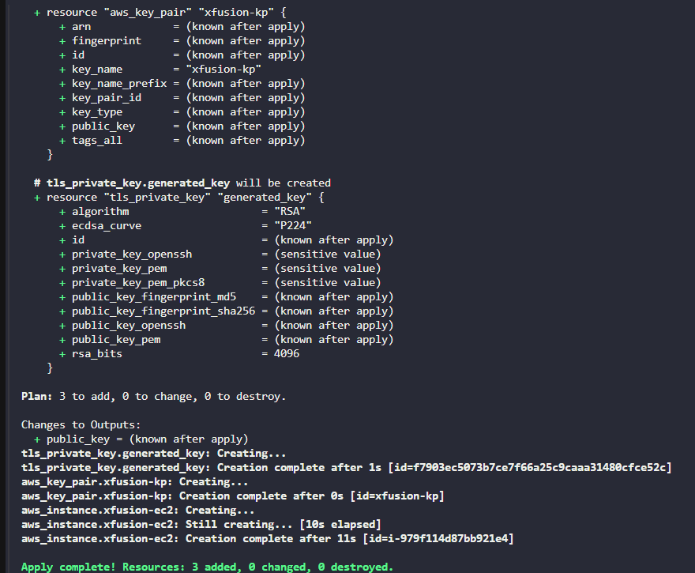

The Nautilus DevOps team is strategizing the migration of a portion of their infrastructure to the AWS cloud. Recognizing the scale of this undertaking, they have opted to approach the migration in incremental steps rather than as a single massive transition. To achieve this, they have segmented large tasks into smaller, more manageable units.

For this task, create an EC2 instance using `Terraform` with the following requirements:

1. The EC2 instance must use the value `xfusion-ec2` as its Name tag, which defines the instance name in AWS.
2. Use the `Amazon Linux` `ami-0c101f26f147fa7fd` to launch this instance.
3. The Instance type must be `t2.micro`.
4. Create a new RSA key named `xfusion-kp`.
5. Attach the default (available by default) security group.
    
    The Terraform working directory is `/home/bob/terraform`. Create the `main.tf` file (do not create a different `.tf` file) to provision the instance.
    
    `Note:` Right-click under the `EXPLORER` section in `VS Code` and select `Open in Integrated Terminal` to launch the terminal.


```
resource "tls_private_key" "generated_key" {
  algorithm = "RSA"
  rsa_bits  = 4096
}

/*
output "public_key" {
    value = tls_private_key.generated_key.public_key_openssh
}
*/

resource "aws_key_pair" "xfusion-kp" {
    public_key = tls_private_key.generated_key.public_key_openssh
    key_name = "xfusion-kp"

}

resource "aws_instance" "xfusion-ec2" {
    ami = "ami-0c101f26f147fa7fd"
    instance_type = "t2.micro"
    key_name      = aws_key_pair.xfusion-kp.key_name

    tags = {
        Name = "xfusion-ec2"
    }
}

output "aws_instance_name" {
    value = aws_instance.xfusion-ec2.tags["Name"]
}

output "aws_instance_id" {
    value = aws_instance.xfusion-ec2.id
}

```





other 

```
resource "tls_private_key" "generated_key" {
  algorithm = "RSA"
  rsa_bits  = 4096
}

resource "aws_key_pair" "nautilus-kp" {
    key_name = "nautilus-kp"
    public_key = tls_private_key.generated_key.public_key_openssh
}

resource "aws_instance" "nautilus-ec2" {
    ami = "ami-0c101f26f147fa7fd"
    instance_type = "t2.micro"
    key_name = "nautilus-kp"
    tags = {
        Name = "nautilus-ec2"
    }
}

output "public_key_content" {
    value = tls_private_key.generated_key.public_key_openssh
}

output "aws_instance_id" {
    value = aws_instance.nautilus-ec2.id
}

output "aws_instance_name" {
    value = aws_instance.nautilus-ec2.tags["Name"]
}


```